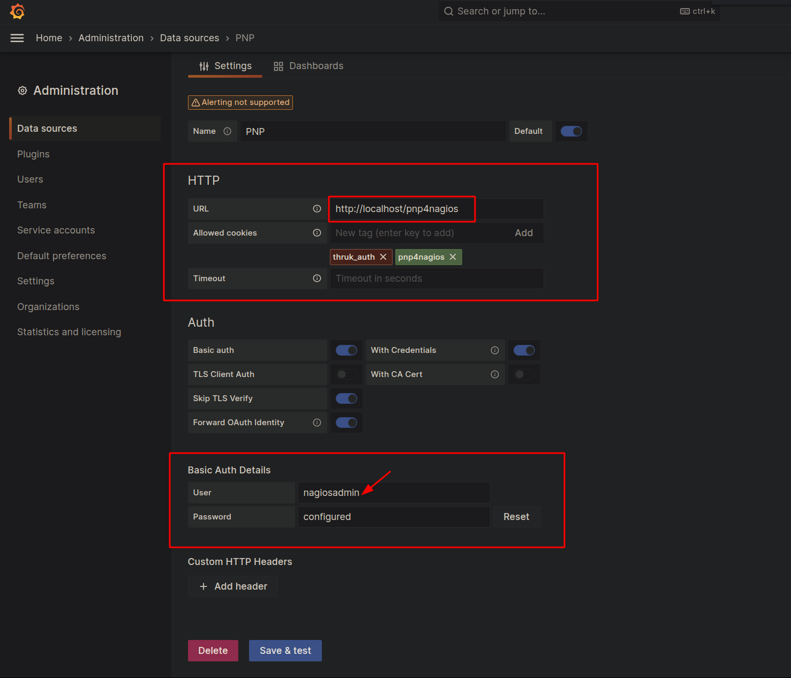
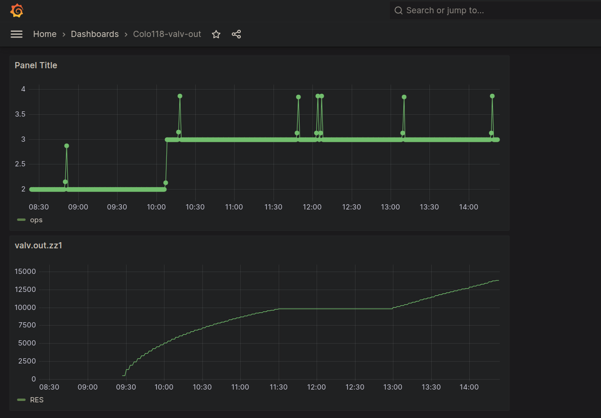
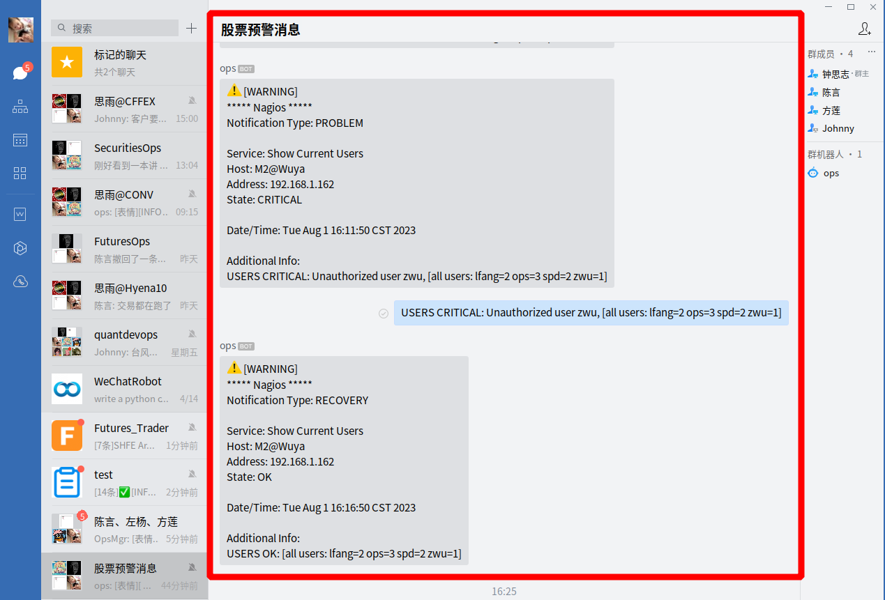

# nagios 安装与使用


`nagios` 是一款用于监控远程机器状态的开源软件，使用了服务端-客户端的设计架构。

本文将详细介绍服务端与客户端的安装步骤。

&lt;!--more--&gt;

其中，特别需要注意的是：

- 目前 `NRPE` 只能支持 `openssl-1.1.1` 版本的 `ssl` 功能，否则会出现错误

    ```bash
    ccxhAMXP.o: In function `get_dh2048&#39;:
    /tmp/nrpe-4.1.0/src/./../include/dh.h:33: undefined reference to `DH_set0_pqg&#39;
    collect2: error: ld returned 1 exit status
    make[1]: *** [nrpe] Error 1
    make[1]: Leaving directory `/tmp/nrpe-4.1.0/src&#39;
    make: *** [all] Error 2
    ...
    undefined reference to `SSL_get1_peer_certificate&#39;
    ```

- `nagios` 依赖 `apache` 提供的 `httpd`，管理页面位于: http://127.0.0.1:80/nagios/。

- `NRPE` 的服务端不需要安装以下功能：

    ```bash
    ## below only for host-client
    ## make install-config &amp;&amp; \
    ## make install-inetd &amp;&amp; \
    ## make install-init &amp;&amp; \
    ## make install-groups-users
    ```
- `nagcmd` 用户

    ```bash
    groupadd nagcmd
    usermod -G nagcmd nagios
    usermod -G nagcmd apache
    chown nagios:nagcmd /usr/local/nagios/var/rw
    chown nagios:nagcmd /usr/local/nagios/var/rw/nagios.cmd

    systemctl restart nagios
    ```

- `perl` 实现命令行自动安装依赖包

    ```bash
    # export PERL_MM_USE_DEFAULT=1 &amp;&amp; \
    # # cpan -i Digest::MD5 &amp;&amp; \
    # # cpan -i Nagios::Config &amp;&amp; \
    # perl -MCPAN -e &#34;install Digest::MD5&#34;  &amp;&amp; \
    # perl -MCPAN -e &#34;install Nagios::Config&#34;  &amp;&amp; \

    yum -y install perl-App-cpanminus.noarch
    export PERL_CPANM_OPT=&#34;--prompt --reinstall -l ~/perl5 --mirror http://cpan.cpantesters.org&#34;
    cpanm Digest::MD5
    cpanm Nagios::Config
    ```

- 在安装 `nagios-graph` 的时候，一定要注意允许修改 `nagios.cfg`

    - `nagios.cfg`

        ````bash
        Modify the Nagios configuration? [n] y
        Path of Nagios configuration file? [/usr/local/nagios/etc/nagios.cfg]
        Path of Nagios commands file? [/usr/local/nagios/etc/objects/commands.cfg]
        ```

    - `apache`

        ```bash
        Modify the Apache configuration? [n] y
        Path of Apache configuration directory? [/etc/httpd/conf.d]
        ```

    整个过程如下：

    ```bash
    checking required PERL modules
      Carp...1.26
      CGI...3.63
      Data::Dumper...2.145
      Digest::MD5...2.52
      File::Basename...2.84
      File::Find...1.20
      MIME::Base64...3.13
      POSIX...1.30
      RRDs...1.4008
      Time::HiRes...1.9725
    checking optional PERL modules
      GD...2.49
      Nagios::Config...36
    checking nagios installation
      found nagios exectuable at /usr/local/nagios/bin/nagios
      found nagios init script at /etc/init.d/nagios
    checking web server installation
      found apache executable at /usr/sbin/httpd
    Destination directory (prefix)? [/usr/local/nagios]
    Location of configuration files (etc-dir)? [/usr/local/nagios/etc/nagiosgraph]
    Location of executables? [/usr/local/nagios/libexec]
    Location of CGI scripts? [/usr/local/nagios/sbin]
    Location of documentation (doc-dir)? [/usr/local/nagios/docs/nagiosgraph]
    Location of examples? [/usr/local/nagios/docs/nagiosgraph/examples]
    Location of CSS and JavaScript files? [/usr/local/nagios/share]
    Location of utilities? [/usr/local/nagios/docs/nagiosgraph/util]
    Location of state files (var-dir)? [/var/nagios]
    Location of RRD files? [/var/nagios/rrd]
    Location of log files (log-dir)? [/var/nagios]
    Path of log file? [/var/nagios/nagiosgraph.log]
    Path of CGI log file? [/var/nagios/nagiosgraph-cgi.log]
    Base URL? [/nagios]
    URL of CGI scripts? [/nagios/cgi-bin]
    URL of CSS file? [/nagios/nagiosgraph.css]
    URL of JavaScript file? [/nagios/nagiosgraph.js]
    URL of Nagios CGI scripts? [/nagios/cgi-bin]
    Path of Nagios performance data file? [/tmp/perfdata.log]
    username or userid of Nagios user? [nagios]
    username or userid of web server user? [apache]
    Modify the Nagios configuration? [n] y
    Path of Nagios configuration file? [/usr/local/nagios/etc/nagios.cfg]
    Path of Nagios commands file? [/usr/local/nagios/etc/objects/commands.cfg]
    Modify the Apache configuration? [n] y
    Path of Apache configuration directory? [/etc/httpd/conf.d]
    configuration:
      ng_prefix            /usr/local/nagios
      ng_etc_dir           /usr/local/nagios/etc/nagiosgraph
      ng_bin_dir           /usr/local/nagios/libexec
      ng_cgi_dir           /usr/local/nagios/sbin
      ng_doc_dir           /usr/local/nagios/docs/nagiosgraph
      ng_examples_dir      /usr/local/nagios/docs/nagiosgraph/examples
      ng_www_dir           /usr/local/nagios/share
      ng_util_dir          /usr/local/nagios/docs/nagiosgraph/util
      ng_var_dir           /var/nagios
      ng_rrd_dir           /var/nagios/rrd
      ng_log_dir           /var/nagios
      ng_log_file          /var/nagios/nagiosgraph.log
      ng_cgilog_file       /var/nagios/nagiosgraph-cgi.log
      ng_url               /nagios
      ng_cgi_url           /nagios/cgi-bin
      ng_css_url           /nagios/nagiosgraph.css
      ng_js_url            /nagios/nagiosgraph.js
      nagios_cgi_url       /nagios/cgi-bin
      nagios_perfdata_file /tmp/perfdata.log
      nagios_user          nagios
      www_user             apache
      modify_nagios_config y
      nagios_config_file   /usr/local/nagios/etc/nagios.cfg
      nagios_commands_file /usr/local/nagios/etc/objects/commands.cfg
      modify_apache_config y
      apache_config_dir    /etc/httpd/conf.d
      apache_config_file
    Continue with this configuration? [y]
    ```

- 需要修改 `rrd` 的权限，否则会报错：no data found in /var/nagios/rrd

    ```bash
    ## -------------------------------------
    ## 修改权限
    ## 解决 no data in /var/nagios/rrd
    # chmod -R 777 /usr/local/nagios
    chmod -R 777 /var/nagios
    ```


# 服务端

## 安装 nagios-core

```bash
sudo yum -y install httpd php gd gd-devel perl postfix &amp;&amp; \
    yum -y install perl perl-CGI &amp;&amp; \
    sudo useradd nagios -p nagios &amp;&amp; \
    sudo groupadd nagcmd &amp;&amp; \
    sudo usermod -G nagcmd nagios &amp;&amp; \
    sudo usermod -G nagcmd apache

export NAGIOS_CORE_VERSION=4.4.13

cd /tmp &amp;&amp; \
    wget -O nagioscore.tar.gz https://github.com/NagiosEnterprises/nagioscore/archive/nagios-${NAGIOS_CORE_VERSION}.tar.gz &amp;&amp; \
    tar -xvf nagioscore.tar.gz &amp;&amp; \
    cd nagioscore-nagios-${NAGIOS_CORE_VERSION} &amp;&amp; \
    ./configure &amp;&amp; \
    make all &amp;&amp; \
    make install &amp;&amp; \
    make install-daemoninit &amp;&amp; \
    make install-config &amp;&amp; \
    make install-commandmode &amp;&amp; \
    make install-webconf
```

## 安装 nagios-plugin

```bash
NAGIOS_PLUGIN_VERSION=2.4.5

cd /tmp &amp;&amp; \
    wget --no-check-certificate -O nagios-plugins.tar.gz https://github.com/nagios-plugins/nagios-plugins/releases/download/release-${NAGIOS_PLUGIN_VERSION}/nagios-plugins-${NAGIOS_PLUGIN_VERSION}.tar.gz &amp;&amp; \
    tar -xvf nagios-plugins.tar.gz &amp;&amp; \
    cd nagios-plugins-${NAGIOS_PLUGIN_VERSION} &amp;&amp; \
    unset ZSH_VERSION &amp;&amp; \
    CFLAGS=&#34;-I/usr/local/openssl/include&#34; LDFLAGS=&#34;-L/usr/local/openssl/lib64&#34; \
    ./configure --with-nagios-user=nagios --with-nagios-group=nagios --with-openssl=/usr/local/openssl &amp;&amp; \
    make -j &amp;&amp; make install
```

## 安装 nagios-nrpe

```bash
NAGIOS_NRPE_VERSION=4.1.0

cd /tmp &amp;&amp; \
    unset ZSH_VERSION &amp;&amp; \
    wget https://www.openssl.org/source/old/1.1.1/openssl-1.1.1t.tar.gz &amp;&amp; \
    tar -xvf openssl-1.1.1t.tar.gz &amp;&amp; \
    cd openssl-1.1.1t &amp;&amp; \
    ./config --prefix=/usr/local --openssldir=/etc/ssl --libdir=lib enable-ssl3 enable-ssl3-method enable-weak-ssl-ciphers -DOPENSSL_NO_GOST zlib shared &amp;&amp; \
    make -j &amp;&amp; make install  &amp;&amp; \
    ln -sfn /usr/local/bin/openssl /usr/bin/openssl &amp;&amp; \
    ln -sfn /usr/local/include/openssl/ /usr/include/openssl &amp;&amp; \
    echo &#34;/usr/local/lib/&#34; &gt;&gt; /etc/ld.so.conf &amp;&amp; \
    ldconfig &amp;&amp; \
    wget --no-check-certificate -O nagios-nrpe.tar.gz https://github.com/NagiosEnterprises/nrpe/releases/download/nrpe-${NAGIOS_NRPE_VERSION}/nrpe-${NAGIOS_NRPE_VERSION}.tar.gz &amp;&amp; \
    tar -xvf nagios-nrpe.tar.gz &amp;&amp; \
    cd nrpe-${NAGIOS_NRPE_VERSION} &amp;&amp; \
    export LDFLAGS=-L/usr/local/lib &amp;&amp; \
    ./configure --enable-command-args --with-nagios-user=nagios --with-nagios-group=nagios &amp;&amp; \
    make all &amp;&amp; \
    make install &amp;&amp; \
    ## below only for host-client
    ## make install-config &amp;&amp; \
    ## make install-inetd &amp;&amp; \
    ## make install-init &amp;&amp; \
    ## make install-groups-users
    rm -rf /tmp/nagios*
```

## 启动服务

```bash
## 启动 http 服务
sudo systemctl restart httpd

## 生成密码
sudo htpasswd -c /usr/local/nagios/etc/htpasswd.users nagiosadmin

New password:
Re-type new password:
Adding password for user nagiosadmin


## 启动服务
systemctl enable nagios
systemctl start nagios
systemctl status nagios

## 开放端口
#firewall-cmd --add-service=http
#firewall-cmd --add-service=https
#firewall-cmd --reload
```

检查一下插件是否已经安装好

```bash
## 远程服务在 192.168.1.162:5666
/usr/local/nagios/libexec/check_nrpe -H 192.168.1.162 -p 5666

## 这时候会调用远程客户端命令，如果显示以下内容则说明匹配成功了
NRPE v4.0.3
```

这样，可以访问: http://127.0.0.1:80/nagios/。

```bash
&lt;!DOCTYPE HTML PUBLIC &#34;-//IETF//DTD HTML 2.0//EN&#34;&gt;
&lt;html&gt;&lt;head&gt;
&lt;title&gt;401 Unauthorized&lt;/title&gt;
&lt;/head&gt;&lt;body&gt;
&lt;h1&gt;Unauthorized&lt;/h1&gt;
&lt;p&gt;This server could not verify that you
are authorized to access the document
requested.  Either you supplied the wrong
credentials (e.g., bad password), or your
browser doesn&#39;t understand how to supply
the credentials required.&lt;/p&gt;
&lt;/body&gt;&lt;/html&gt;
```

## 添加监控客户机器

可以参考 `/usr/local/nagios/etc/objects/localhost.cfg`， 比如这个客户端 `/usr/local/nagios/etc/research-machines/m2.cfg`

```bash
# 中间的内容块是用于设置设备信息的
define host {
    # use 关键字表示使用的模版，模版将在后续讲解，此处使用的是 linux-server 模版
    use                             linux-server
    # host_name 关键字表示机器的名字，也是在 Web 界面中显示的名字
    host_name                       M2
    # alias 表示机器的别名，一般用作机器别名的描述
    alias                           M2@WuyaCapital
    # address 设置该机器的 IP 地址，以便与数据的获取与被动监控的请求
    address                         192.168.1.162
    # 最大的尝试次数，也就是在某服务监控出错再次运行监控命令获取数据的次数
    max_check_attempts              3
    # 检测的时间段
    check_period                    24x7
    # 发送消息提醒的时间间隔
    notification_interval           30
    # 发送消息提醒的时间段
    notification_period             24x7
}

define service{
    use                             local-service,graphed-service         ; Name of service template to use
    host_name                       M2
    service_description             Current Users
    check_command                   check_nrpe!check_users
    check_interval                  1
    retry_interval                  1
    check_period                    24x7
    notification_interval           1
    notification_period             24x7
    notifications_enabled           1
    register                        1
}

define service{
    use                             local-service,graphed-service         ; Name of service template to use
    host_name                       M2
    service_description             Total Procs
    check_command                   check_nrpe!check_total_procs
    check_interval                  1
    retry_interval                  1
    check_period                    24x7
    notification_interval           1
    notification_period             24x7
    notifications_enabled           1
    register                        1
}
```


同时，我们需要修改命令

```bash
vim /usr/local/nagios/etc/objects/commands.cfg

# &#39;check_NRPE&#39; command definition
define command{
    command_name check_nrpe
    command_line $USER1$/check_nrpe -H $HOSTADDRESS$ -p $ARG1$ -c $ARG2$
}
```

# 客户端

```bash
sudo yum -y install zlib-devel xinetd
sudo useradd nagios -p nagios
```

## 安装 nagios-plugin

同服务端的安装: [nagios-plugin](#安装-nagios-plugin)

## 安装 nagios-nrpe

```bash
NAGIOS_NRPE_VERSION=4.1.0

cd /tmp &amp;&amp; \
    unset ZSH_VERSION &amp;&amp; \
    wget https://www.openssl.org/source/old/1.1.1/openssl-1.1.1t.tar.gz &amp;&amp; \
    tar -xvf openssl-1.1.1t.tar.gz &amp;&amp; \
    cd openssl-1.1.1t &amp;&amp; \
    ./config --prefix=/usr/local --openssldir=/etc/ssl --libdir=lib enable-ssl3 enable-ssl3-method enable-weak-ssl-ciphers -DOPENSSL_NO_GOST zlib shared &amp;&amp; \
    make -j &amp;&amp; make install  &amp;&amp; \
    ln -sfn /usr/local/bin/openssl /usr/bin/openssl &amp;&amp; \
    ln -sfn /usr/local/include/openssl/ /usr/include/openssl &amp;&amp; \
    echo &#34;/usr/local/lib/&#34; &gt;&gt; /etc/ld.so.conf &amp;&amp; \
    ldconfig &amp;&amp; \
    wget --no-check-certificate -O nagios-nrpe.tar.gz https://github.com/NagiosEnterprises/nrpe/releases/download/nrpe-${NAGIOS_NRPE_VERSION}/nrpe-${NAGIOS_NRPE_VERSION}.tar.gz &amp;&amp; \
    tar -xvf nagios-nrpe.tar.gz &amp;&amp; \
    cd nrpe-${NAGIOS_NRPE_VERSION} &amp;&amp; \
    export LDFLAGS=-L/usr/local/lib &amp;&amp; \
    ./configure --enable-command-args --with-nagios-user=nagios --with-nagios-group=nagios &amp;&amp; \
    make all &amp;&amp; \
    make install &amp;&amp; \
    ## below only for host-client
    make install-config &amp;&amp; \
    make install-inetd &amp;&amp; \
    make install-init &amp;&amp; \
    make install-groups-users
    rm -rf /tmp/nagios*
```

## 启动服务

```bash
systemctl enable xinetd
systemctl restart xinetd
systemctl status xinetd

systemctl enable nrpe
systemctl restart nrpe
systemctl status nrpe

## 检查是否已经启动 nrpe
netstat -at | egrep &#34;nrpe|5666&#34;

## 检查服务是否启程
/usr/local/nagios/libexec/check_nrpe -H localhost

NRPE v4.1.0

## 检查插件是否可用
/usr/local/nagios/libexec/check_nrpe -H localhost -c check_users

USERS OK - 5 users currently logged in |users=5;5;10;0

## 修改客户端监控项目与内容
vim /usr/local/nagios/etc/nrpe.cfg

# The following examples allow user-supplied arguments and can
# only be used if the NRPE daemon was compiled with support for
# command arguments *AND* the dont_blame_nrpe directive in this
# config file is set to &#39;1&#39;.  This poses a potential security risk, so
# make sure you read the SECURITY file before doing this.
### MISC SYSTEM METRICS ###
# command[check_users]=/usr/local/nagios/libexec/check_users -w 5 -c 10
command[check_load]=/usr/local/nagios/libexec/check_load -r -w .15,.10,.05 -c .30,.25,.20
command[check_hda1]=/usr/local/nagios/libexec/check_disk -w 20% -c 10% -p /dev/hda1
command[check_zombie_procs]=/usr/local/nagios/libexec/check_procs -w 5 -c 10 -s Z
command[check_total_procs]=/usr/local/nagios/libexec/check_procs -w 150 -c 200

# The following examples allow user-supplied arguments and can
# only be used if the NRPE daemon was compiled with support for
# command arguments *AND* the dont_blame_nrpe directive in this
# config file is set to &#39;1&#39;.  This poses a potential security risk, so
# make sure you read the SECURITY file before doing this.
### MISC SYSTEM METRICS ###
command[check_users]=/usr/local/nagios/libexec/check_users -w $ARG1$ -c $ARG2$
#command[check_load]=/usr/local/nagios/libexec/check_load $ARG1$
#command[check_disk]=/usr/local/nagios/libexec/check_disk $ARG1$
#command[check_swap]=/usr/local/nagios/libexec/check_swap $ARG1$
#command[check_cpu_stats]=/usr/local/nagios/libexec/check_cpu_stats.sh $ARG1$
#command[check_mem]=/usr/local/nagios/libexec/custom_check_mem -n $ARG1$


## 允许接入的服务器ip
allowed_hosts=127.0.0.1
allowed_hosts=192.168.1.162

## 日志文件
log_file=/usr/local/nagios/var/nrpe.log

## 允许传递参数
## 这样服务器可以调用参数：/usr/local/nagios/libexec/check_nrpe -H127.0.0.1 -p56118 -c check_users -a &#34;2 10&#34;
## 在 command.cfg 可以这样使用参数传递：command_line $USER1$/check_nrpe -H $HOSTADDRESS$ -p $ARG1$ -c $ARG2$ -a $ARG3$
## 在 colo.cfg 调用命令：check_command check_nrpe!56118!check_users!&#34;2 10&#34;
##
dont_blame_nrpe=1
```

# 编写 nagios-plugin

## show-users

- [Show Users](https://exchange.nagios.org/directory/Plugins/System-Metrics/Users/Show-Users/details)
- [show_users](https://exchange.nagios.org/directory/Plugins/Operating-Systems/Linux/show_users/details)
- [show_users.sh](https://exchange.nagios.org/components/com_mtree/attachment.php?link_id=3497&amp;cf_id=24)

### 代码

```bash
#!/bin/bash
#
#   Copyright Hari Sekhon 2007
#
#   This program is free software; you can redistribute it and/or modify
#   it under the terms of the GNU General Public License as published by
#   the Free Software Foundation; either version 2 of the License, or
#   (at your option) any later version.
#
#   This program is distributed in the hope that it will be useful,
#   but WITHOUT ANY WARRANTY; without even the implied warranty of
#   MERCHANTABILITY or FITNESS FOR A PARTICULAR PURPOSE.  See the
#   GNU General Public License for more details.
#
#   You should have received a copy of the GNU General Public License
#   along with this program; if not, write to the Free Software
#   Foundation, Inc., 51 Franklin St, Fifth Floor, Boston, MA  02110-1301  USA
#

# Nagios Plugin to list all currently logged on users to a system.

# Modified by Rob MacKenzie, SFU - rmackenz@sfu.ca
# Added the -w and -c options to check for number of users.


version=0.3

# This makes coding much safer as a varible typo is caught
# with an error rather than passing through
set -u

# Note: resisted urge to use &lt;&lt;&lt;, instead sticking with |
# in case anyone uses this with an older version of bash
# so no bash bashers please on this

# Standard Nagios exit codes
OK=0
WARNING=1
CRITICAL=2
UNKNOWN=3

usage(){
    echo &#34;usage: ${0##*/} [--simple] [ --mandatory username ] [ --unauthorized username ] [ --whitelist username ]&#34;
    echo
    echo &#34;returns a list of users on the local machine&#34;
    echo
    echo &#34;   -s, --simple show users without the number of sessions&#34;
    echo &#34;   -m username, --mandatory username&#34;
    echo &#34;                Mandatory users. Return CRITICAL if any of these users are not&#34;
    echo &#34;                currently logged in&#34;
    echo &#34;   -b username, --blacklist username&#34;
    echo &#34;                Unauthorized users. Returns CRITICAL if any of these users are&#34;
    echo &#34;                logged in. This can be useful if you have a policy that states&#34;
    echo &#34;                that you may not have a root shell but must instead only use &#34;
    echo &#34;                &#39;sudo command&#39;. Specifying &#39;-u root&#39; would alert on root having&#34;
    echo &#34;                a session and hence catch people violating such a policy.&#34;
    echo &#34;   -a username, --whitelist username&#34;
    echo &#34;                Whitelist users. This is exceptionally useful. If you define&#34;
    echo &#34;                a bunch of users here that you know you use, and suddenly&#34;
    echo &#34;                there is a user session open for another account it could&#34;
    echo &#34;                alert you to a compromise. If you run this check say every&#34;
    echo &#34;                3 minutes, then any attacker has very little time to evade&#34;
    echo &#34;                detection before this trips.&#34;
    echo
    echo &#34;                -m,-u and -w can be specified multiple times for multiple users&#34;
    echo &#34;                or you can use a switch a single time with a comma separated&#34;
    echo &#34;                list.&#34;
    echo &#34;   -w integer, --warning integer&#34;
    echo &#34;                Set WARNING status if more than INTEGER users are logged in&#34;
    echo &#34;   -c integer, --critical integer&#34;
    echo &#34;                Set CRITICAL status if more than INTEGER users are logged in&#34;
    echo
    echo
    echo &#34;   -V --version Print the version number and exit&#34;
    echo
    exit $UNKNOWN
}

simple=&#34;&#34;
mandatory_users=&#34;&#34;
unauthorized_users=&#34;&#34;
whitelist_users=&#34;&#34;
warning_users=0
critical_users=0

while [ &#34;$#&#34; -ge 1 ]; do
    case &#34;$1&#34; in
-h|--help)  usage
                    ;;
-V|--version)  echo $version
                    exit $UNKNOWN
                    ;;
-s|--simple)  simple=true
                    ;;
-m|--mandatory)  if [ &#34;$#&#34; -ge 2 ]; then
                        if [ -n &#34;$mandatory_users&#34; ]; then
                            mandatory_users=&#34;$mandatory_users $2&#34;
                        else
                            mandatory_users=&#34;$2&#34;
                        fi
                        shift
                    else
                        usage
                    fi
                    ;;
-b|--blacklist)  if [ &#34;$#&#34; -ge 2 ]; then
                        if [ -n &#34;$unauthorized_users&#34; ]; then
                            unauthorized_users=&#34;$unauthorized_users $2&#34;
                        else
                            unauthorized_users=&#34;$2&#34;
                        fi
                        shift
                    else
                        usage
                    fi
                    ;;
-a|--whitelist)  if [ &#34;$#&#34; -ge 2 ]; then
                        if [ -n &#34;$whitelist_users&#34; ]; then
                            whitelist_users=&#34;$whitelist_users $2&#34;
                        else
                            whitelist_users=&#34;$2&#34;
                        fi
                        shift
                    else
                        usage
                    fi
                    ;;
-w|--warning)  if [ &#34;$#&#34; -ge 2 ]; then
                        if [ $2 -ge 1 ]; then
                            warning_users=$2
                        fi
                        shift
                    else
                        usage
                    fi
                    ;;
-c|--critical)  if [ &#34;$#&#34; -ge 2 ]; then
                        if [ $2 -ge 1 ]; then
                            critical_users=$2
                        fi
                        shift
                    else
                        usage
                    fi
                    ;;
                *)  usage
                    ;;
    esac
    shift
done

mandatory_users=&#34;`echo $mandatory_users | tr &#39;,&#39; &#39; &#39;`&#34;
unauthorized_users=&#34;`echo $unauthorized_users | tr &#39;,&#39; &#39; &#39;`&#34;
whitelist_users=&#34;`echo $whitelist_users | tr &#39;,&#39; &#39; &#39;`&#34;

# Must be a list of usernames only.
userlist=&#34;`who|grep -v &#34;^ *$&#34;|awk &#39;{print $1}&#39;|sort`&#34;
usercount=&#34;`who|wc -l`&#34;

errormsg=&#34;&#34;
exitcode=$OK

if [ -n &#34;$userlist&#34; ]; then
    if [ -n &#34;$mandatory_users&#34; ]; then
        missing_users=&#34;&#34;
        for user in $mandatory_users; do
            if ! echo &#34;$userlist&#34;|grep &#34;^$user$&#34; &gt;/dev/null 2&gt;&amp;1; then
                missing_users=&#34;$missing_users $user&#34;
                exitcode=$CRITICAL
            fi
        done
        for user in `echo $missing_users|tr &#34; &#34; &#34;\n&#34;|sort -u`; do
            errormsg=&#34;${errormsg}user &#39;$user&#39; not logged in. &#34;
        done
    fi

    if [ -n &#34;$unauthorized_users&#34; ]; then
        blacklisted_users=&#34;&#34;
        for user in $unauthorized_users; do
            if echo &#34;$userlist&#34;|sort -u|grep &#34;^$user$&#34; &gt;/dev/null 2&gt;&amp;1; then
                blacklisted_users=&#34;$blacklisted_users $user&#34;
                exitcode=$CRITICAL
            fi
        done
        for user in `echo $blacklisted_users|tr &#34; &#34; &#34;\n&#34;|sort -u`; do
            errormsg=&#34;${errormsg}Unauthorized user &#39;$user&#39; is logged in! &#34;
        done
    fi

    if [ -n &#34;$whitelist_users&#34; ]; then
        unwanted_users=&#34;&#34;
        for user in `echo &#34;$userlist&#34;|sort -u`; do
            if ! echo $whitelist_users|tr &#34; &#34; &#34;\n&#34;|grep &#34;^$user$&#34; &gt;/dev/null 2&gt;&amp;1; then
                unwanted_users=&#34;$unwanted_users $user&#34;
                exitcode=$CRITICAL
            fi
        done
        for user in `echo $unwanted_users|tr &#34; &#34; &#34;\n&#34;|sort -u`; do
            errormsg=&#34;${errormsg}Unauthorized user &#39;$user&#39; detected! &#34;
        done
    fi

    if [ $warning_users -ne 0 -o $critical_users -ne 0 ]; then
	unwanted_users=`who`
	if [ $usercount -ge $critical_users -a $critical_users -ne 0 ]; then
	    exitcode=$CRITICAL
	elif [ $usercount -ge $warning_users -a $warning_users -ne 0 ]; then
	    exitcode=$WARNING
	fi
	OLDIFS=&#34;$IFS&#34;
	IFS=$&#39;\n&#39;
        for user in $unwanted_users; do
            errormsg=&#34;${errormsg} --- $user&#34;
        done
	IFS=&#34;$OLDIFS&#34;
    fi

    if [ &#34;$simple&#34; == &#34;true&#34; ]
        then
        finallist=`echo &#34;$userlist&#34;|uniq`
    else
        finallist=`echo &#34;$userlist&#34;|uniq -c|awk &#39;{print $2&#34;(&#34;$1&#34;)&#34;}&#39;`
    fi
else
    finallist=&#34;no users logged in&#34;
fi

if [ &#34;$exitcode&#34; -eq $OK ]; then
    echo &#34;USERS OK:&#34; $finallist
    exit $OK
elif [ &#34;$exitcode&#34; -eq $WARNING ]; then
    echo &#34;USERS WARNING: [users: &#34;$finallist&#34;]&#34; $errormsg
    exit $WARNING
elif [ &#34;$exitcode&#34; -eq $CRITICAL ]; then
    echo &#34;USERS CRITICAL: [users: &#34;$finallist&#34;]&#34; $errormsg
    exit $CRITICAL
else
    echo &#34;USERS UNKNOWN:&#34; $errormsg&#34;[users: &#34;$finallist&#34;]&#34;
    exit $UNKNOWN
fi

exit $UNKNOWN
```

### 配置

```bash
Plugin worked properly. Just set below things.

On Nagios Server:
* Create a file &#34;show_users&#34; in your libexec directory.

* Copy all the &#34;show_users.txt&#34; contents in &#34;show_users&#34; file

* chmod 755 show_users
* chown nagios:nagios show_users
* Open your host configuration file &amp; type below configuration.

define service{
use generic-service ; Inherit values from a template
host_name Dell NFS Server
service_description Logged Users
check_command check_nrpe!show_users

On NRPE Client:

* Copy show_users file in &#34;libexec&#34; directory
* vim nrpe.cfg, add below line

command[show_users]=/usr/local/nagios/libexec/show_users

Save &amp; Exit &amp; restart NRPE/Xinetd service

That&#39;s it.
```

## 配置 nagios-graph

- 参考这个博客:[Steps to Install Nagiosgraph for Nagios Core on CentOS 7](https://sysadminxpert.com/install-nagiosgraph-for-nagios-core-on-centos-7/)
- 安装的时候，一定要记得允许修改 `nagios` 与 `apache` 配置，**不要一键到底**

```bash
locate /etc/httpd/conf/httpd.conf
## cgi

## 先安装 perl-core
yum install -y perl-core

## 进入 perl 命令行模式，开始安装

perl -MCPAN -e shell
1) install Digest::MD5
2) install Nagios::Config

## 修改权限
chmod 777 -R /usr/local/nagios

## 修改 templates.cfg, 一定要改成 /nagios/cgi-bin/....
define service {
    name            graphed-service
    action_url      /nagios/cgi-bin/show.cgi?host=$HOSTNAME$&amp;service=$SERVICEDESC$&#39; onMouseOver=&#39;showGraphPopup(this)&#39; onMouseOut=&#39;hideGraphPopup()&#39; rel=&#39;/nagiosgraph/cgi-bin/showgraph.cgi?host=$HOSTNAME$&amp;service=$SERVICEDESC$&amp;period=week&amp;rrdopts=-w&#43;450&#43;-j
    register        0
}

## 测试打开 http://127.0.0.1:8080/nagios/cgi-bin/showconfig.cgi
```

## 配置 pnp4nagios

- [开源监控解决方案Nagios&#43;Cacti&#43;PNP4Nagios&#43;NConf&#43;NDOUtils&#43;Nagvis（三）pnp4nagios安装](http://120.132.124.40:8877/zixun/77838.html)

```bash
sudo /etc/init.d/npcd restart
systemctl restart npcd
systemctl restart httpd
```

### 安装 pnp4nagios

```bash
cd /tmp
wget -O pnp4nagios.tar.gz https://github.com/lingej/pnp4nagios/archive/0.6.26.tar.gz
tar -xvf pnp4nagios.tar.gz
cd pnp4nagios-0.6.26

./configure --with-rrdtool=/usr/bin/rrdtool  --with-perfdata-dir=/usr/local/nagios/share/perfdata --with-perfdata-spool-dir=/usr/local/nagios/share/spool --with-nagios-user=nagios --with-nagios-group=nagios


make all
make install
make install-webconf
make install-config
make install-init
```

#### 配置

```bash
cd  /usr/local/pnp4nagios/etc
mv misccommands.cfg-sample misccommands.cfg
mv nagios.cfg-sample nagios.cfg
mv rra.cfg-sample rra.cfg
cd /usr/local/pnp4nagios/etc/pages/
mv web_traffic.cfg-sample web_traffic.cfg
cd ../check_commands
mv check_all_local_disks.cfg-sample  check_all_local_disks.cfg
mv check_nrpe.cfg-sample  check_nrpe.cfg
mv check_nwstat.cfg-sample  check_nwstat.cfg

## 启动服务
sudo /etc/init.d/npcd restart
systemctl restart npcd
systemctl restart httpd

## 修改 /usr/local/nagios/etc/objects/templates.cfg
cp /usr/local/nagios/etc/objects/templates.cfg /usr/local/nagios/etc/objects/templates.cfg.orig
## ----------------------------------------------
vim /usr/local/nagios/etc/objects/templates.cfg

define host {
      name       host-pnp
      register   0
      action_url /pnp4nagios/index.php/graph?host=$HOSTNAME$&amp;srv=_HOST_&#39; class=&#39;tips&#39; rel=&#39;/pnp4nagios/index.php/popup?host=$HOSTNAME$&amp;srv=_HOST_
      process_perf_data              1
}
define service {
      name       srv-pnp
      register   0
      action_url /pnp4nagios/index.php/graph?host=$HOSTNAME$&amp;srv=$SERVICEDESC$&#39; class=&#39;tips&#39; rel=&#39;/pnp4nagios/index.php/popup?host=$HOSTNAME$&amp;srv=$SERVICEDESC$
      process_perf_data              1
}

define host{
       name                   gchost
       use                    host-pnp
       max_check_attempts       1
       normal_check_interval    2
       retry_check_interval     1
       check_period          24x7
       contact_groups        myself_group
       notification_interval  2
       notification_period   24x7
       notification_options   d,u,r
       check_command          check-host-alive
       }

define service{
       name                    myself_temp
       use                     srv-pnp
       max_check_attempts      2
       normal_check_interval   2
       retry_check_interval    1
       check_period            24x7
       notification_interval   2
       notification_period     24x7
       notification_options    w,u,c,r
       contact_groups          myself_group
       check_command           check-host-alive
       register                0
}

## 修改 /usr/local/nagios/etc/nagios.cfg
cd /usr/local/nagios/etc/nagios.cfg /usr/local/nagios/etc/nagios.cfg.orig
## -------------------------------------
vim /usr/local/nagios/etc/nagios.cfg

process_performance_data=1
enable_environment_macros=1
host_perfdata_file=/usr/local/pnp4nagios/var/host-perfdata
service_perfdata_file=/usr/local/pnp4nagios/var/service-perfdata
host_perfdata_file_template=DATATYPE::HOSTPERFDATA\tTIMET::$TIMET$\tHOSTNAME::$HOSTNAME$\tHOSTPERFDATA::$HOSTPERFDATA$\tHOSTCHECKCOMMAND::$HOSTCHECKCOMMAND$\tHOSTSTATE::$HOSTSTATE$\tHOSTSTATETYPE::$HOSTSTATETYPE$
service_perfdata_file_template=DATATYPE::SERVICEPERFDATA\tTIMET::$TIMET$\tHOSTNAME::$HOSTNAME$\tSERVICEDESC::$SERVICEDESC$\tSERVICEPERFDATA::$SERVICEPERFDATA$\tSERVICECHECKCOMMAND::$SERVICECHECKCOMMAND$\tHOSTSTATE::$HOSTSTATE$\tHOSTSTATETYPE::$HOSTSTATETYPE$\tSERVICESTATE::$SERVICESTATE$\tSERVICESTATETYPE::$SERVICESTATETYPE$\tSERVICEOUTPUT::$SERVICEOUTPUT$
host_perfdata_file_mode=a
service_perfdata_file_mode=a
host_perfdata_file_processing_interval=15
service_perfdata_file_processing_interval=15
host_perfdata_file_processing_command=process-host-perfdata-file
service_perfdata_file_processing_command=process-service-perfdata-file

## 修改 /usr/local/nagios/etc/objects/commands.cfg
cp /usr/local/nagios/etc/objects/commands.cfg /usr/local/nagios/etc/objects/commands.cfg.orig
## --------------------------------------------------
vim /usr/local/nagios/etc/objects/commands.cfg

define command{
    command_name process-service-perfdata-file
    command_line /usr/local/pnp4nagios/libexec/process_perfdata.pl --bulk=/usr/local/pnp4nagios/var/service-perfdata
}
define command{
    command_name process-host-perfdata-file
    command_line /usr/local/pnp4nagios/libexec/process_perfdata.pl --bulk=/usr/local/pnp4nagios/var/host-perfdata
}


## 修改 apache 配置  /etc/httpd/conf/httpd.conf
cd /etc/httpd/conf/httpd.conf /etc/httpd/conf/httpd.conf.orig
## -----------------------------------
vim /etc/httpd/conf/httpd.conf

Alias /pnp4nagios &#34;/usr/local/pnp4nagios/share&#34;

&lt;Directory &#34;/usr/local/pnp4nagios/share&#34;&gt;
    AllowOverride None
    Order allow,deny
    Allow from all
    #
    # Use the same value as defined in nagios.conf
    #
    AuthName &#34;Nagios Access&#34;
    AuthType Basic
    AuthUserFile /usr/local/nagios/etc/htpasswd.users
    Require valid-user
        &lt;IfModule mod_rewrite.c&gt;
                  #Turn on URL rewriting
                  RewriteEngine On
                  Options symLinksIfOwnerMatch
                  #Installation directory
                  RewriteBase /pnp4nagios/
                  #Protect application and system files from being viewed
                  RewriteRule &#34;^(?:application|modules|system)/&#34; - [F]
                  #Allow any files or directories that exist to be displayed directly
                  RewriteCond &#34;%{REQUEST_FILENAME}&#34; !-f
                  RewriteCond &#34;%{REQUEST_FILENAME}&#34; !-d
                  #Rewrite all other URLs to index.php/URL
                  RewriteRule &#34;^.*$&#34; &#34;index.php/$0&#34; [PT]
        &lt;/IfModule&gt;
&lt;/Directory&gt;

## 查看效果：http://&lt;ip&gt;:&lt;port&gt;/pnp4nagios/
## 检查各项安装是否符合条件，然后删除这个页面
mv /usr/local/pnp4nagios/share/install.php /usr/local/pnp4nagios/share/install.php.orig

## 复制鼠标悬停效果: 在下载的源代码里面，如 /tmp/pnp4nagios-0.6.26/contrib
cp /tmp/pnp4nagios-0.6.26/contrib/ssi/* /usr/local/nagios/share/ssi/

## 测试启动
/usr/local/nagios/bin/nagios -v /usr/local/nagios/etc/nagios.cfg
systemctl restart httpd
systemctl restart npcd
systemctl restart nagios

## 应用到监控项目
## 由于 pnp4nagios 与 nagios-graph 冲突，二者只能选一个使用
vim /usr/local/nagios/etc/colo-machines/colo118.cfg

define service {
    # use                             local-service,graphed-service,srv-pnp           ; Name of service template to use
    use                             local-service,srv-pnp           ; Name of service template to use
    host_name                       Colo118
    service_description             Current Proc Memory valv_out_zz1
    check_command                   check_nrpex!15118!check_proc_mem!&#34;-w10240 -c20480 --pattern=.*valv.out.zz1.*&#34;
    check_interval                  3
    retry_interval                  1
    check_period                    24x7
    notification_interval           1
    notification_period             24x7
    notifications_enabled           1
    register                        1
}
```

### grafana

- [nagios&#43;grafana](https://www.zybuluo.com/sww4718168/note/116559)
- [https://www.centlinux.com/2019/02/install-grafana-pnp4nagios-centos-7.html](https://www.centlinux.com/2019/02/install-grafana-pnp4nagios-centos-7.html)

```bash
cd /tmp
wget https://dl.grafana.com/enterprise/release/grafana-enterprise-10.0.0-1.x86_64.rpm

## 安装 grafana
sudo yum install grafana-enterprise-10.0.0-1.x86_64.rpm
systemctl daemon-reload
systemctl enable grafana-server.service
systemctl start grafana-server.service
systemctl restart grafana-server.service

## 安装 PNP plugin
sudo grafana-cli plugins install sni-pnp-datasource

# service firewalld restart
# firewall-cmd --permanent --add-port=3000/tcp
# firewall-cmd --reload
# service firewalld restart

## 下载 api
cd /usr/local/pnp4nagios/share/application/controllers/
wget -O api.php &#34;https://github.com/lingej/pnp-metrics-api/raw/master/application/controller/api.php&#34;
systemctl restart grafana-server.service

## 配置 pnp4nagios
cp /etc/httpd/conf.d/pnp4nagios.conf /etc/httpd/conf.d/pnp4nagios.conf.orig
sed -i &#39;/Allow from all/a\        Allow from 127.0.0.1 ::1&#39; /etc/httpd/conf.d/pnp4nagios.conf
sed -i &#39;/Require valid-user/a\        Require all granted&#39; /etc/httpd/conf.d/pnp4nagios.conf
sed -i &#39;/Require valid-user/a\        Require ip 127.0.0.1 ::1&#39; /etc/httpd/conf.d/pnp4nagios.conf
sed -i &#39;s/Allow from all/#&amp;/&#39; /etc/httpd/conf.d/pnp4nagios.conf
sed -i &#39;s/AuthName/#&amp;/&#39; /etc/httpd/conf.d/pnp4nagios.conf
sed -i &#39;s/AuthType Basic/#&amp;/&#39; /etc/httpd/conf.d/pnp4nagios.conf
sed -i &#39;s/AuthUserFile/#&amp;/&#39; /etc/httpd/conf.d/pnp4nagios.conf
sed -i &#39;s/Require valid-user/#&amp;/&#39; /etc/httpd/conf.d/pnp4nagios.conf

systemctl restart httpd.service

## 配置 grafana, 首次登录，账户:admin，密码:admin
## 配置 pnp data source
## 生成密码，使用这个在 grafana 登录 pnp
htpasswd -b /usr/local/nagios/etc/htpasswd.users nagiosadmin *********
## 打开页面, http://127.0.0.1:3000
```





### 企业微信通知

&gt; 企业微信对于机器人与群助手的渲染不一样，导致 `\n` 的判断不同
&gt;
&gt; ```python
&gt; if re.search(&#39;Robot&#39;, str(type(w)), re.IGNORECASE):
&gt;     msgx = cli.args.msg.replace(&#39;\\n&#39;, &#39;\n&#39;)
&gt; else:
&gt;     msgx = cli.args.msg.replace(&#39;\\n&#39;, &#39;&lt;br&gt;&#39;).replace(&#39;\n&#39;, &#39;&lt;br&gt;&#39;)
&gt; ```

参考：

- [4 Steps to Define Nagios Contacts With Email and Pager Notification](https://www.thegeekstuff.com/2009/06/4-steps-to-define-nagios-contacts-with-email-and-pager-notification/)
- [Creating a new e-mail contact](https://subscription.packtpub.com/book/cloud-and-networking/9781849515566/1/ch01lvl1sec11/creating-a-new-e-mail-contact)
- [nagios macro](https://assets.nagios.com/downloads/nagioscore/docs/nagioscore/3/en/macrolist.html)
- 介绍如何使用 `nagios` 宏定义：[using macro in commans](http://nagios.manubulon.com/traduction/docs25en/macros.html)

#### 建立 python 通知脚本

```python
from wepy.utils.init import *

if __name__ == &#39;__main__&#39;:
    ## -------------------------------------------
    cli = CliParser(&#34;wechat from command line&#34;)
    cli.add(&#34;who&#34;, type=str, default=&#39;wx_test&#39;)
    cli.add(&#34;msg&#34;, type=str, default=&#34;&#34;)
    cli.add(&#34;level&#34;, type=str, default=&#39;info&#39;)
    cli.show()
    ## -------------------------------------------
    if cli.args.who not in globals():
        msg = f&#34;&#34;&#34;
            {cli.args.who=} does not exist
            &#34;&#34;&#34;
        log.err(msg)
        raise Exception(msg)

    w = globals().get(cli.args.who)
    if re.search(&#39;Robot&#39;, str(type(w)), re.IGNORECASE):
        msgx = cli.args.msg.replace(&#39;\\n&#39;, &#39;\n&#39;)
    else:
        msgx = cli.args.msg.replace(&#39;\\n&#39;, &#39;&lt;br&gt;&#39;).replace(&#39;\n&#39;, &#39;&lt;br&gt;&#39;)
    w.send(msgx, cli.args.level)
```

#### 修改 generic-contact

这个是**模板**，我们可以通过继承来实现具体的 `contact1`

```bash
vim /usr/local/nagios/etc/objects/templates.cfg

define contact {

    name                            generic-contact         ; The name of this contact template
    service_notification_period     24x7                    ; service notifications can be sent anytime
    host_notification_period        24x7                    ; host notifications can be sent anytime
    # service_notification_options    w,u,c,r,f,s             ; send notifications for all service states, flapping events, and scheduled downtime events
    service_notification_options    u,c,r,f,s             ; send notifications for all service states, flapping events, and scheduled downtime events
    host_notification_options       d,u,r,f,s               ; send notifications for all host states, flapping events, and scheduled downtime events
    # service_notification_commands   notify-service-by-email,notify-service-by-wechat    ; send service notifications via email
    # host_notification_commands      notify-host-by-email,notify-host-by-wechat          ; send host notifications via email
    service_notification_commands   notify-service-by-wechat    ; send service notifications via email
    host_notification_commands      notify-host-by-wechat          ; send host notifications via email
    register                        0                       ; DON&#39;T REGISTER THIS DEFINITION - ITS NOT A REAL CONTACT, JUST A TEMPLATE!
}
```

#### 修改 contact

```bash
vim /usr/local/nagios/etc/objects/contacts.cfg

define contact {

    contact_name            nagiosadmin             ; Short name of user
    use                     generic-contact         ; Inherit default values from generic-contact template (defined above)
    alias                   Nagios Admin            ; Full name of user
    # email                   nagios@localhost ; &lt;&lt;***** CHANGE THIS TO YOUR EMAIL ADDRESS ******
    email                   william.lian.fang@gmail.com ; &lt;&lt;***** CHANGE THIS TO YOUR EMAIL ADDRESS ******
    host_notification_commands     notify-host-by-wechat
    host_notification_options      d,u,r
    host_notification_period       24x7
    service_notification_commands  notify-service-by-wechat
    service_notification_options   w,u,c,r  ; 可以修改不同的设置
    service_notification_period    24x7
}

define contact {
    contact_name                    test                 ; Short name of user
    use                             generic-contact         ; Inherit default values from generic-contact template (defined above)
    alias                           Nagios Dev              ; Full name of user
    email                           william.lian.fang@gmail.com ;

    host_notifications_enabled      1
    service_notifications_enabled   1

    host_notification_period        24x7
    service_notification_period     24x7

    host_notification_options       d,u,r,f,s,n
    service_notification_options    w,u,c,r,f,s             ; send notifications for all service states, flapping events, and scheduled downtime events

    host_notification_commands      notify-host-by-wechat-test
    service_notification_commands   notify-service-by-wechat-test
}

```

还可以设置 `contact-groups`

```bash
vim /usr/local/nagios/etc/objects/contacts.cfg

define contactgroup {

    contactgroup_name       admins
    alias                   Nagios Administrators
    members                 nagiosadmin,test
}
```

#### 添加监控 commands

```bash
vim /usr/local/nagios/etc/objects/commands.cfg

##### notify-host-by-wechat command definition
define command{
    command_name notify-host-by-wechat
    command_line /usr/local/python3/bin/python3 /app/wechat_cli.py --who=&#39;wx_test&#39; --msg=$(/usr/bin/printf &#34;%b&#34; &#34;***** Nagios *****\n\nNotification Type: $NOTIFICATIONTYPE$\nHost: $HOSTNAME$\nState: $HOSTSTATE$\nAddress: $HOSTADDRESS$\nInfo: $HOSTOUTPUT$\n\nDate/Time: $LONGDATETIME$\n&#34;) --level=&#39;$HOSTSTATE$&#39;
}
##### notify-service-by-wechat command definition
define command{
    command_name notify-service-by-wechat
    command_line /usr/local/python3/bin/python3 /app/wechat_cli.py --who=&#39;robot_secops&#39; --msg=&#34;***** Nagios *****\nNotification Type: $NOTIFICATIONTYPE$\n\nService: $SERVICEDESC$\nHost: $HOSTALIAS$\nAddress: $HOSTADDRESS$\nState: $SERVICESTATE$\n\nDate/Time: $LONGDATETIME$\n\nAdditional Info:\n$SERVICEOUTPUT$&#34; --level=&#39;$SERVICESTATE$&#39;
}

define command{
    command_name notify-host-by-wechat-test
    command_line /usr/local/python3/bin/python3 /app/wechat_cli.py --who=&#39;wx_test&#39; --msg=$(/usr/bin/printf &#34;%b&#34; &#34;***** Nagios *****\n\nNotification Type: $NOTIFICATIONTYPE$\nHost: $HOSTNAME$\nState: $HOSTSTATE$\nAddress: $HOSTADDRESS$\nInfo: $HOSTOUTPUT$\n\nDate/Time: $LONGDATETIME$\n&#34;) --level=&#39;$HOSTSTATE$&#39;
}
define command{
    command_name notify-service-by-wechat-test
    command_line /usr/local/python3/bin/python3 /app/wechat_cli.py --who=&#39;wx_test&#39; --msg=&#34;***** Nagios *****\nNotification Type: $NOTIFICATIONTYPE$\n\nService: $SERVICEDESC$\nHost: $HOSTALIAS$\nAddress: $HOSTADDRESS$\nState: $SERVICESTATE$\n\nDate/Time: $LONGDATETIME$\n\nAdditional Info:\n$SERVICEOUTPUT$&#34; --level=&#39;$SERVICESTATE$&#39;
}

```

#### 设置监控项目

```bash
define host {
    ## --------------------------------
    contacts              	nagiosadmin 	; 以上的 contacts 组
    notifications_enabled   1 				; 0, 1
	## --------------------------------
}

define service {
    ## --------------------------------
    contacts              	nagiosadmin 	; 以上的 contacts 组
    notifications_enabled   1 				; 0, 1
	## --------------------------------
}

define service
    # use                             local-service,graphed-service,srv-pnp           ; Name of service template to use
    use                             local-service,srv-pnp           ; Name of service template to use
    host_name                       Colo118
    service_description             NTP time
    check_command                   check_nrpex!15118!check_ntp_time!&#34;--benchmark=$(echo $(date &#43;%Y-%m-%dT%H:%M:%S.%6N)) --warning=300000 --critical=500000&#34;
    check_interval                  1
    retry_interval                  1
    check_period                    24x7
    notification_interval           1
    notification_period             24x7
    notifications_enabled           1
    register                        1
    contacts                        test ; 用法发送监控
}
```



# Ref

- [Nagios on CentOS 7](https://gist.github.com/evanjuang/d81ca6f05aa02e2d92ad68f5f867235c)
- [How to install Nagios on linux step by step?](https://www.psychz.net/client/question/en/how-to-install-nagios-on-linux-step-by-step.html)
- [Nagios: How to Enable check_nrpe Command Line Arguments](https://www.thegeekstuff.com/2010/12/enable-nrpe-command-arguments/)
- [NRPE - Configuring NRPE Commands To Accept Arguments](https://support.nagios.com/kb/article/nrpe-configuring-nrpe-commands-to-accept-arguments-759.html)
- [Nagios服务器端配置文件详解](https://www.cnblogs.com/ginvip/p/6506008.html)
- [install-nagios.sh](https://github.com/mconf/installation-scripts/blob/master/nagios/install-nagios.sh)
- [nagios-graph](https://github.com/loitho/Docker-Nagios-Nagvis-Nagiosgraph/blob/master/run.sh)
- [Steps to Install Nagiosgraph for Nagios Core on CentOS 7](https://sysadminxpert.com/install-nagiosgraph-for-nagios-core-on-centos-7/)
- [nagios-graph](https://nagios.fm4dd.com/nagiosgraph/)


---

> 作者: william  
> URL: https://williamlfang.github.io/2023-07-09-nagios-%E5%AE%89%E8%A3%85%E4%B8%8E%E4%BD%BF%E7%94%A8/  

