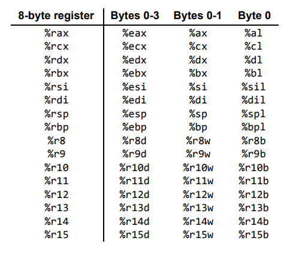
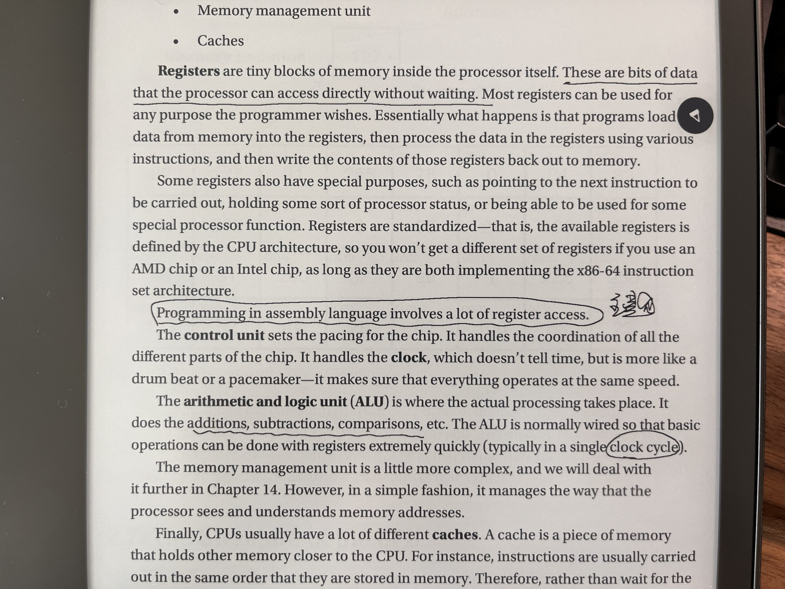

# 汇编入门


最近在学习汇编语言，这里做一下简要的记录，主要使用的参考书：

- Jonathan Bartlett: [Learn to Program with Assembly: Foundational Learning for New Programmers](https://www.amazon.com/-/zh/dp/1484274369/ref=sr_1_1?keywords=learn&#43;to&#43;program&#43;with&#43;assembly&amp;qid=1690090378&amp;sprefix=learn&#43;to&#43;program%2Caps%2C380&amp;sr=8-1)
- Jonathan Bartlett: [Programming from the Ground Up](https://www.amazon.com/-/zh/dp/0975283847/ref=sr_1_5?__mk_zh_CN=%E4%BA%9A%E9%A9%AC%E9%80%8A%E7%BD%91%E7%AB%99&amp;crid=3HQWUL7PU4EDU&amp;keywords=Jonathan&#43;Bartlett&amp;qid=1690090419&amp;sprefix=learn&#43;to&#43;program&#43;with&#43;assembly%2Caps%2C884&amp;sr=8-5)
- [CSci 241: Assembly Language Programming](https://staffwww.fullcoll.edu/aclifton/courses/cs241/)
- [MIT Computation Structures](https://ocw.mit.edu/courses/6-004-computation-structures-spring-2017/)

其实，我最早是先看了 PGU，因为这是一本开源书籍，后来才看阅读 LPA，发现 LPA 其实是 PGU 的出版社书籍，是对 PGU 进行更加系统化的整理，并升级了汇编到 `x86-64` 。所以推荐直接看 LPA 即可。

&lt;!--more--&gt;

# Ch01：为何学习汇编

## 理解计算机内部

计算机编程语言划分为

- High-level programming languages （HLPL）
- Low-level programming languages （LLPL）

对于大部分的程序员，我们一般都使用 HLPL 进行编程开发，而较少使用（甚至看不懂）LLPL。这是因为随着计算机技术的发展，越来越多的高级编程语言为我们做了太多的事情，使得我们远离底层、面向问题进行编程。HLPL 主要做的事情是：

- 通过逐层的抽象（Abstract），允许程序员尽量远离计算机底层技术，而直接调用编程语言提供的语法糖进行操作。这些编程语言通过 `compiler` 或者 `interpreter` 翻译成机器语言
- 程序员不再思考计算机内部如何实现指令运算，而只需要按照高级程序语言的规则，把问题空间映射到解决方案空间。

然后，如果我们需要更深入的理解计算机内部的运行机制，理解我们在高级编程语言设计的求解方案如何被映射到计算机的运行指令（机器语言，`0-1`），就需要站在计算的解读思考，理解操作指令在内部是如何被执行的。

虽然现代计算机已经高度智能化，AI 正如火如荼的渗入我们生活的各个方面。但在底层，计算机其实只能进行有限的运算，理解特定的操作指令，即二进制代码（亦或机器代码）。我们这里说的理解计算机，当然不是直接去看由这些 `0-1` 所组成的机器代码，而是以人类可以理解的方式阅读机器代码。这就是汇编语言（`Assemly Language`）。

可以把汇编理解成机器代码的翻译，而且这种关系是**一一映射**，即一个汇编指令就是代表一条计算机所能执行的最小单元指令，如数字相加：

- 对于高级语言：`a = 0 &#43; 1`

- 对于机器代码：`48 83 c7 01`
- 对于汇编语言：`addq $1 %rdi`

```assembly
.global _start
_start:
    movq    $60, %rax
    movq    $0, %rdi
    addq    $1, %rdi
    syscall
```

```bash
## assembling and linker into executable(elf)
as test.asm -o test.o
ld test.o -o test

## run
./test
echo $?

## disassembly with AT&amp;T
objdump -M att -d test.o

test.o:     file format elf64-x86-64
Disassembly of section .text:

0000000000000000 &lt;_start&gt;:
   0:   48 c7 c0 3c 00 00 00    mov    $0x3c,%rax
   7:   48 c7 c7 00 00 00 00    mov    $0x0,%rdi
   e:   48 83 c7 01             add    $0x1,%rdi
  12:   0f 05                   syscall
```

通过上面的例子，我们可以知道计算系在底层是如何进行运算的

- 先给寄存器 `%rdi` 初始化
- 然后对寄存器 `%rdi` 执行 `add` 指令，这个对应对应了机器代码 `83`

可见，无论我们是否从事汇编开发，了解一些关于汇编的知识，有助于我们更加深入了解计算机内部的运行机制（英文说法是：under the hood）。

## 学习汇编的好处

- know how the computer really works, underneath the hood, fundamentally
- demystifying the operation of your most basic tool: the processor, how the processor itself thinks about the code
- better mental model of compiler, debugging, optimization, high-performance-related work

## 汇编版本：Intel vs AT&amp;T

在上面的例子中，我们使用了 `objdump` 工具用来**把二进制代码翻译成汇编语言**，其中

- `-d` 表示 `disassemle`，即反汇编。

- `-M att` 表示使用 `AT&amp;T` 汇编风格展示

### ISA：指令集

`Instrument Set Architecture`（ISA）表示计算机可以识别的不同指令架构，主流的有：

- `x86` 指令集，包括 `x86-32` 、`x86-64`，也称作 `AMD`（因为最初的 AMD 提出的）。这个大部分 `Unix-Linux` 使用。
- `ARM` 指令集，主要是手机设备使用。
- `PowerPC` 指令集

### Intel 与 AT&amp;T 风格

虽然有`assembler` 生成的机器代码都是一样的（才能保证计算机实现的结果的一致且唯一），不同的组织在如何表示 `assembly language` 风格上却有一定的区别。目前主要有两个风格的汇编代码：

- `Intel` 也称作 `NASM`（Netwide Assembler），这个主要是 `Intel` 公司在操作手册所使用的的汇编风格。
- `AT&amp;T` 也称作 `GAS`（GUN Assembler）这个是 `Linux` 、`GCC` 所采用的汇编风格。

我们刚才说过，不同汇编语法只是的风格上有所差别，但最近生成的机器代码都是一样的。因此，也可以通过工具将两个汇编风格进行互转。以下是关于两者的参考链接：

- [AT&amp;T Syntax versus Intel Syntax](https://www.cs.mcgill.ca/~cs573/winter2001/AttLinux_syntax.htm)

- [Intel vs. AT&amp;T syntax](https://staffwww.fullcoll.edu/aclifton/courses/cs241/syntax.html)
- [Differences in Intel (NASM) vs AT&amp;T (GAS) Syntax.](https://sdasgup3.github.io/Intel_Vs_Att_format/)

|                       | Intel                                       | AT&amp;T                                           |
| --------------------- | ------------------------------------------- | ---------------------------------------------- |
| 注释(comment)         | 使用英文分号：`;`                           | 使用 `#`，即 `c-style`                         |
| register              | 不需要前缀 %&lt;br /&gt;mov eas, 1                | 需要带前缀 %&lt;br /&gt;movq $1, %eax                |
| direction             | instr dest src&lt;br /&gt;mov eas, 1              | instr src dest&lt;br /&gt;movq $1, %eas              |
| memory&lt;br /&gt;(address) | mov     eax,[ebx] &lt;br /&gt;mov     eax,[ebx&#43;3] | movl    (%ebx),%eax &lt;br /&gt;movl    3(%ebx),%eax |
|                       |                                             |                                                |
|                       |                                             |                                                |


### %r vs %e

由于汇编语言的发展经历了漫长的历史过程（最近甚至可以追溯到晶体管），汇编语言在表示寄存器的符号方面也经过多次调整：

- `%rax`
- `%eax`
- `%ax`
- `%ah`, `%al`

可以参考以下链接，介绍相关的历史

- [x86-64 Machine-Level Programming](https://www.cs.cmu.edu/~fp/courses/15213-s07/misc/asm64-handout.pdf)



# Ch02：理解计算机如何工作

## CPU 的组成与运行





可以说，`CPU` 充其量就是一个机械设备，只要不断电，它都会**永不停歇**地讯循环执行以上命令。而作为程序员，我们需要告诉 `CPU` 如何正确地、严格按照我们设计的方案执行。计算机无所谓对错（bug），它们只是一台机器，本身也无法写出 bug，真正写 bug 的是人。我之前看过一篇博客，说的就是我们在写代码时，一定要秉承着没有 `bug` 的想法，只要我们设计的程序没有 `bug`，`CPU` 就一定没有 `bug`。在计算机底层的机器代码眼里，世界只有 `0-1` ，或者说 `on-off`。

&gt; *“If you want more effective programmers, you will discover that they should not waste their time debugging, they should not introduce the bugs to start with.” —Edsger Dijkstra, Turing Award Lecture (1972)*
&gt;
&gt; If you want a single piece of advice to reduce your bug count, it’s this: *Re-read your code frequently.* After writing a few lines of code (3 to 6 lines, a short block within a function), re-read them. That habit will save you more time than any other simple change you can make.
&gt;
&gt; - [Don&#39;t write bugs](https://www.teamten.com/lawrence/programming/dont-write-bugs.html)


# Ch03：汇编基础

首先介绍一个在 `x86-64` 架构中，不同的内存模块大小

- `1 byte` (8 bits, `0000 0000`)，范围为 `0-255`，即 `ASCII`
- `2 bytes` (16 bits)，即 `word` 、`short`
- `4 bytes` (32 bits)， 即 `double word`、`long`

- `8 bytes` (64 bits)，即 `quadword`，这是目前主流的 `x86-64` 系统

以上的内存模块可以理解成 `CPU` 每次提取（请求）内存的单元，比如对于一个汇编指令

```ass
## 取一个 byte: 00000010
movb $0b10, %rdi

## 取一个 long: 0000&#39;0000 0000&#39;0000 0000&#39;0000 0000&#39;0010
movq $1, %rdi

## 取一个 quadword: 0000&#39;0000 0000&#39;0000 0000&#39;0000 0000&#39;0000 0000&#39;0000 0000&#39;0000 0000&#39;0000 0000&#39;0010
movq $1, %rdi
```

而在操作系统层面，为了加快读取内存，往往还会在增加一层抽象，采用 `paging` 分页的方式，以更大的模块来分配内存，一般来说，默认的 `paging size` 是 `4k`(4096 bytes)。


## 汇编语法


```assembly
.global _start

_start:
    movq $60, %rax
    movq $123, %rdi
    syscall
```

上面一个一个完整的汇编代码，我们可以进行编译，并打印出执行结果：

```bash
as ch03-demo01.asm -o ch03-demo01.o
ld ch03-demo01.o -o ch03-demo01
./ch03-demo01
echo $?

## 运行结果即为上面的汇编指令： movq $123, %rdi
123
```

### global(globl)

`global` （也可以写作 `globl`，二者是等价的）告诉 `linker` 此处设定的 `label` 需要保留以备他用。一般来说，如果没有添加 `global` 指示，`linker` 会把当前模块下我们自己设定的变量名忽略，而添加了 `global`，则要求不要这么做，因为有可能其他的模块有使用到。

特别的，`.global _start` 是作为可执行的入口，这个一定要保存。

### _start：entry point

这个是二进制的入库，相当于 `main` 在 `C/C&#43;&#43;` 编程中的作用。无论汇编代码的顺序如何，操作系统在执行目标时，都是从 `_start` 开始逐行执行汇编代码。

### label

表示一个名称，但实际上该名称所在的内存地址起始位置（以及后面紧随的内存），用来给 `assembler` 找到相应的内存地址。

### %rax: system call code

`%rax` (Accumulate) 表示寄存器的作用，通常用来代表系统调用的指令，如上述代码中我们将其设置为 `60`，这代表 `system call` 的 `sys_exit` 代号。

具体的 `system call code` 可以参考：

- [Linux System Call Table](https://chromium.googlesource.com/chromiumos/docs/&#43;/master/constants/syscalls.md)

- [Searchable Linux Syscall Table for x86 and x86_64](https://filippo.io/linux-syscall-table/)

```mar
Instruction: syscall

Return value found in: %rax

Syscalls are implemented in functions named as in the Entry point column, or with the DEFINE_SYSCALLx(%name% macro.
```

| %rax | %rdi: **arg0**       | Name  | Entry Point  | Implementation                                               |
| ---- | -------------------- | ----- | ------------ | ------------------------------------------------------------ |
| 0    | unsigned int fd      | read  | sys_read     | [fs/read_write.c](https://git.kernel.org/cgit/linux/kernel/git/torvalds/linux.git/tree/fs/read_write.c) |
| 1    | unsigned int fd      | write | sys_write    | [fs/read_write.c](https://git.kernel.org/cgit/linux/kernel/git/torvalds/linux.git/tree/fs/read_write.c) |
| 2    | const char *filename | open  | sys_open     | [fs/open.c](https://git.kernel.org/cgit/linux/kernel/git/torvalds/linux.git/tree/fs/open.c) |
| 3    | unsigned int fd      | close | sys_close    | [fs/open.c](https://git.kernel.org/cgit/linux/kernel/git/torvalds/linux.git/tree/fs/open.c) |
| 4    | const char *filename | stat  | sys_newstat  | [fs/stat.c](https://git.kernel.org/cgit/linux/kernel/git/torvalds/linux.git/tree/fs/stat.c) |
| 5    | unsigned int fd      | fstat | sys_newfstat | [fs/stat.c](https://git.kernel.org/cgit/linux/kernel/git/torvalds/linux.git/tree/fs/stat.c) |
| 6    | const char *filename | lstat | sys_newlstat | [fs/stat.c](https://git.kernel.org/cgit/linux/kernel/git/torvalds/linux.git/tree/fs/stat.c) |
| ...  |                      |       |              |                                                              |
| 60   | int error_code       | exit  | sys_exit     | [kernel/exit.c](https://git.kernel.org/cgit/linux/kernel/git/torvalds/linux.git/tree/kernel/exit.c) |
|      |                      |       |              |                                                              |


### %rdi: exit status code

用于保存系统调用的结果，访问为： `0~255`


## 汇编工具

### as

### ld

## 汇编周边（相关工具）

### hexdump

### objdump

## gdb(cgdb)

### disassemble

# Ch04：Assembly Programming

## 寄存器

### 不同功能的寄存器

我们在 [寄存器历史](###%r vs %e)列举了 `x86-32` 与 `x86-64` 架构下的寄存器类型。这里做一个总结：

- `general-purpose registers`

  - `computational`
    - `%rax`: `accumulative` 累计量
      - 用来执行 `system call ` 的代码
      - 用来保存 `mulq` 、`divq` 的结果

    - `%rbx`: `base indexing`，通常用来处理 `memory addressing` 相关的操作
    - `%rcx` : `counting register`，通过用在 `loop`
    - `%rdx`: `data register`，用来保存数据相关，如对于 `mulq`、`divq` 等操作，由于只能通过 `register` 或者 `memory address`，通常是先把数值放到 `%rdx`，然后再与 `%rax` 进行操作

  - `data-related`
    - `%rsi`: `source index`
    - `%rdi`: `destination index`，可以用来保存 `exit status code`

- `specific-purpose registers`

  - `%rip`&#39;：`instrument point`，指向下一个指令的内存地址

    

  - `%eflags` 用来处理跳转指令相关的操作

      


### 使用不同的字节计算（内存与性能）

```assembly
.global _start

_start:
         ##0000&#39;0001&#39;0000&#39;0010      ## %bh          ## %bl          ## %bx
    movw $0b0000000100000010, %bx   ## 0000&#39;0001    ## 0000&#39;0010    ##
    addb %bh, %bl                                   ## 2&#43;1 = 3= 0000&#39;0011
    movb $0, %bh                    ## 0000&#39;0000

    movq %rbx, %rdi                 ## %rbx: 0000&#39;0000|0000&#39;0011
                                    ## %rdi: 0000&#39;0000|0000&#39;0011 = 3
    ## ------------
    movq $60, %rax
    syscall
```

## 运算符

- `addq`:

  - format: `addq src dst`

    ```assembly
    ## %rdi = %rdi &#43; %ras
    addq %rax, %rdi
    ```

- `subq`

  - format: `subq src dst`

    ```assembly
    ## %rdi = %rdi - %ras
    subq %rax, %rdi
    ```

- `incq`：（&#43;1）

  - format: `addq dst`

    ```assembly
    ## %rdi = %rdi &#43; 1
    incq %rdi
    ```

- `decq`：（-1）

  - format: `decq dst`

    ```assembly
    ## %rdi = %rdi - 1
    decq %rdi
    ```

- `mulq`

  - format: `mulq src`

    ```assembly
    mulq %rdi
    ```

  - 注意，`mulq` 和 `divq` 的作用结果保留在 `%rax`，而且只能用 `register` 或者 `memory address`，不能用普通的 `number value`

- `divq`

  - format: `divq src`
  - 与 `mulq` 相同

```assembly
.global _start
.section .text

_start:
                        ## rdi      ## rax
    movq $3, %rdi       ## 3
    movq %rdi, %rax                 ## 3
    add %rdi, %rax                  ## 3&#43;3=6
    mulq %rdi                       ## 3*6=18
    subq %rdi, %rax                 ## 18-3=15
    divq %rdi                       ## 15/3=5
    movq %rax, %rdi     ## 5

    ## -------------
    movq $60, %rax
    syscall
```

### 比较

#### `%eflags`

汇编在很多地方都使用 `%eflags` 来判断真假，比如

- `jmp`
- `cmp`
- `looq`，是的，`loop` 也是通过调用 `decq %rcx`  是否为 `0` 来决定循环结束与否。（如果 `%rcx` 变为 `0`，则 `%eflags` 设置为 `true`（`ZF`））

我们可以通过 `ZF` 或者 `CF` 进行跳转，但是这个有点不直观

- `jz`
- `jnz`
- `jc`
- `jnc`


#### cmp

本质上，`cmp` 做的事情跟 `%eflags` 是相关的

- 通过寄存器相减，得到一个值
- 判断这个值是否为 `0` 然后进行 `ZF` 判断，
- 但是，有意思的是，`cmp` 此时不会重置寄存器
- 需要注意的是，由于 `cmp` 在实现上，是通过 `dst` 减去 `src` 的值来判断 `%eflags`，所以如果遇到一个寄存器与一个字面数值对比，**一定要把字面数值放在前面，然后减法的操作是无效的**

可以这样理解

- 在操作上：

  ```assembly
  cmpq %rax, %rbx
  ```

- 在内部实现上：

  ```assembly
  subq %rax, %rbx

  ## using %elags to jmp
  ```

- `je` : `%rax == %rbx`

- `jne`

- `ja`：jump **A**bove for `%rax &gt; %rbx`

- `jae`

- `jb`：jump **B**elow for `%rax &lt; %rbx`

- `jbe`


### 跳转

在介绍不同[寄存器](##寄存器)的时候，我们区分了 `general` 与 `specific` ，其中有一个寄存器 `%rip` 指向下一个指令的内存地址，我们可以使用 `jmp` 来调整。本质上，`jmp` 是直接找到对应 `label` 上的内存地址，然后跳转到那里执行指令。

因此，我们可以利用这一点，实现代码的**跳转**与**循环**。

```assembly
.global _start

_start:
    movq $25, %rax
    jmp thelabel

somewhere:
    movq %rax, %rdi
    jmp anotherlabel

label1:
    addq %rbx, %rax
    movq $5, %rbx
    jmp here

labellabel:
    syscall

anotherlabel:
    movq $60, %rax
    jmp labellabel

thelabel:
    movq %rax, %rbx
    jmp there

here:
    divq %rbx
    jmp somewhere

there:
    addq $5, %rbx
    jmp label1

anywhere:
    jmp thelabel
```


|              | %rax      | %rbx    | %rdi |
| ------------ | --------- | ------- | ---- |
| _start       | 25        |         |      |
| thelabel     |           | 25      |      |
| there        |           | 5&#43;25=30 |      |
| label1       | 30&#43;25=55  | 5       |      |
| here         | 55/5=11   |         |      |
| somewhere    |           |         | 11   |
| anotherlabel | 60        |         |      |
| labellabel   | (syscall) |         |      |


#### 数据

#### bit 操作

### stack 与 function

### 汇编函数

### 系统调用

### 模块与链接

# Ch05：计算机架构与设计


---

> 作者: william  
> URL: https://williamlfang.github.io/2023-07-23-%E6%B1%87%E7%BC%96%E5%85%A5%E9%97%A8/  

