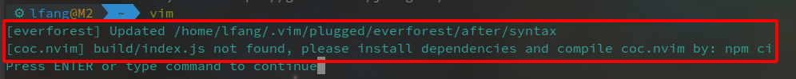
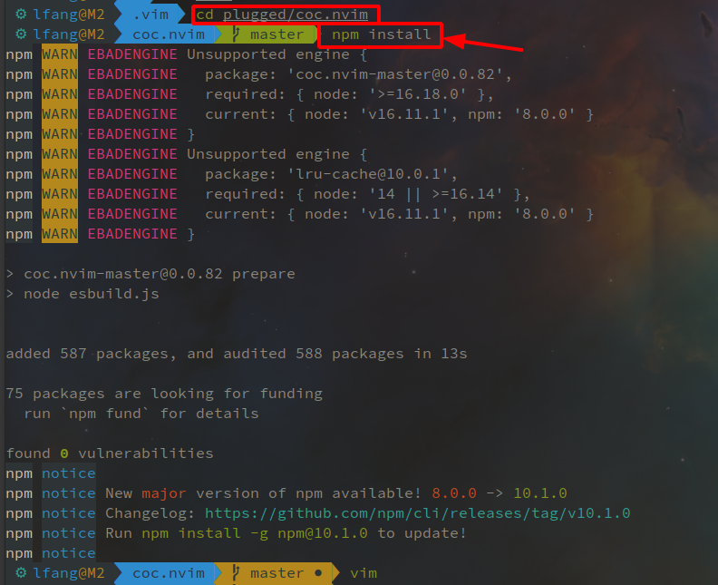

# vim coc 更新出现异常


`vim` 更新插件 `coc` 后运行出现异常：



需要重新安装 `coc`，然后重新启动 `vim` 即可。

```bash
cd /home/william/.vim/plugged/coc.nvim
npm install
```



&lt;!--more--&gt;


---

> 作者: william  
> URL: https://williamlfang.github.io/2023-09-18-vim-coc-%E6%9B%B4%E6%96%B0%E5%87%BA%E7%8E%B0%E5%BC%82%E5%B8%B8/  

